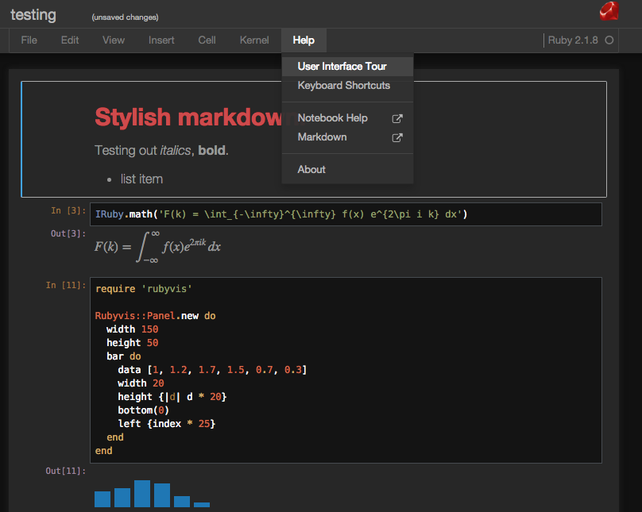
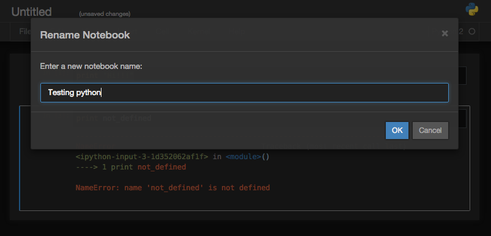
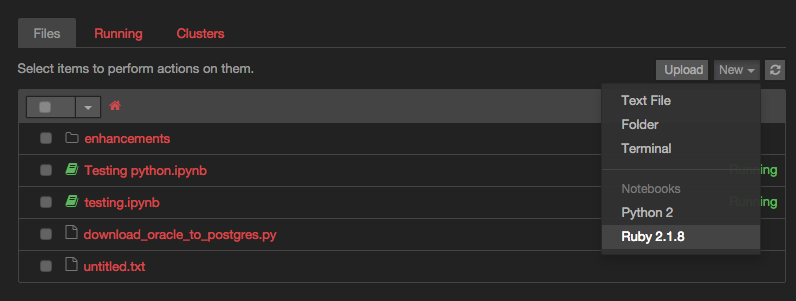
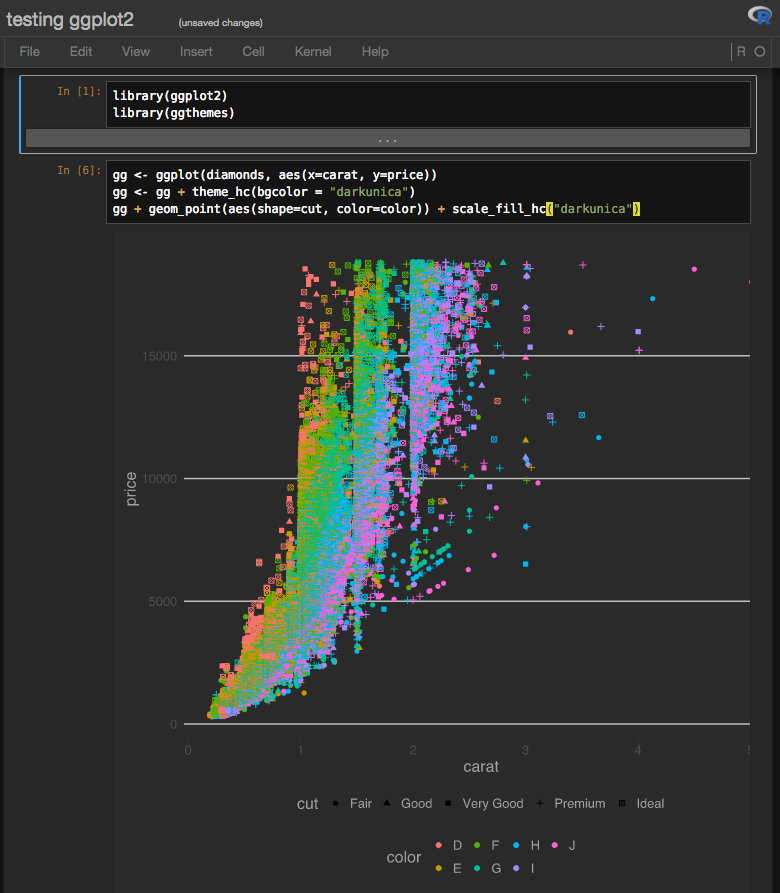

# Dark theme for Jupyter Notebook (iPython 4)

This is a completely dark theme for the [Jupyter Notebook](http://jupyter.org/) interface, including the notebook list, dialogs, and menus. Jupyter includes [iPython 4](http://ipython.org/) as its default kernel (which, confusingly, supports both Python 2.x and 3.x). Since the [iPython 3 to 4 transition](http://ipython.org/#jupyter-and-the-future-of-ipython), it has gained better support for [other interpreters](https://github.com/ipython/ipython/wiki/IPython-kernels-for-other-languages) like R and Ruby. It is possible to [upgrade](http://jupyter.readthedocs.org/en/latest/install.html#upgrading) iPython 2 or 3 to Jupyter + iPython 4.

Source code coloring is based on the Twilight theme for Textmate.  Print preview output for notebooks retains a white background with printable foreground colors.

## Installing

To install this theme, copy or symlink `custom.css` into `~/.jupyter/custom/` (create that directory if it doesn't exist.) Then, whenever you run `jupyter notebook`, `iruby notebook`, etc. it will use this theme.

## Screenshots

For [ggplots](http://ggplot2.org/) that match the theme, I recommend using the dark HighCharts themes from [ggthemes](https://github.com/jrnold/ggthemes).

